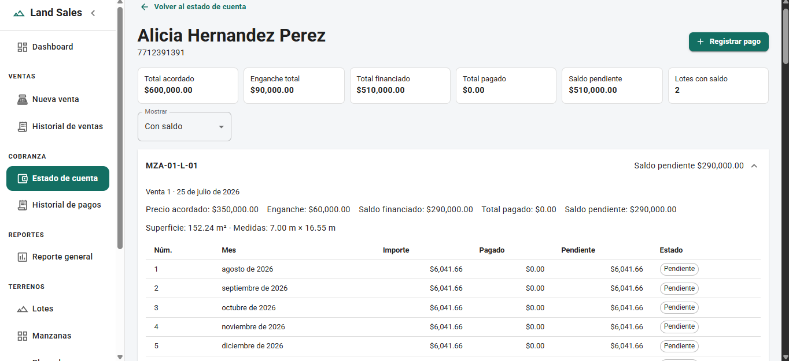
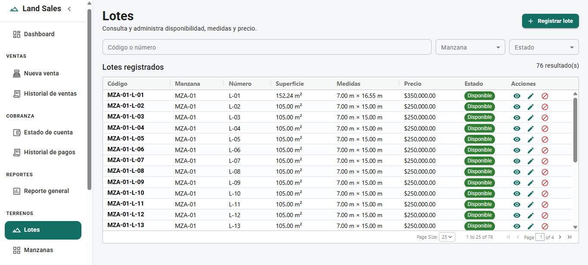
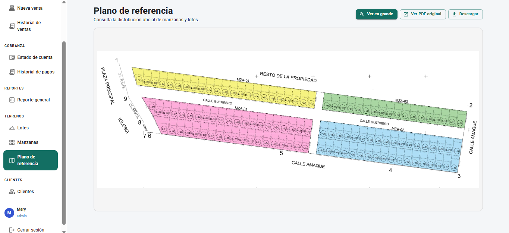
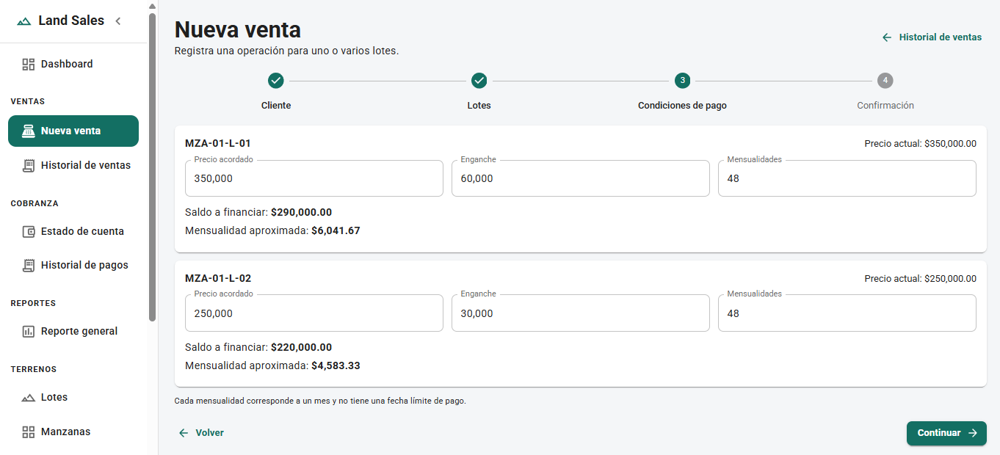
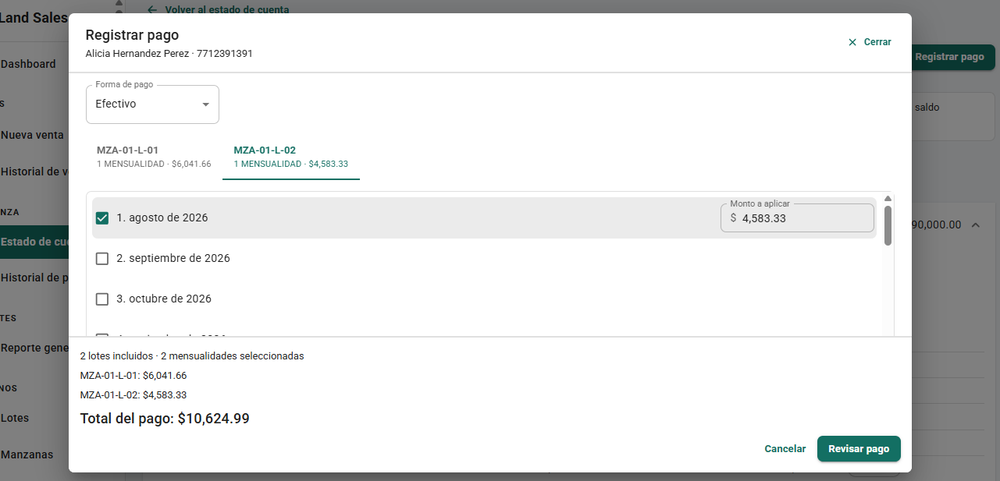
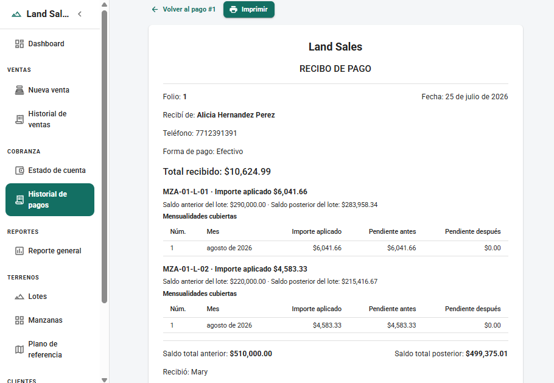

# Land Sales System

[English](README.md) | [Español](docs/README.es.md)

Land Sales System is a full-stack web application developed to digitize the operations of a family-owned land sales business.

The system centralizes block and lot management, customers, multi-lot financed sales, installment plans, payments, account statements, printable receipts, and operational reports.

It was created from a real business need and demonstrates full-stack development with React, Spring Boot, PostgreSQL, transactional financial workflows, and concurrency controls.

> **Status:** Functional portfolio project under active development. The main workflows for lot management, customers, sales, financing, payments, account statements, receipts, and reports are implemented.

## Application Preview

| Customer account statement | Lot management |
| --- | --- |
|  |  |

| Reference plan | Sale registration |
| --- | --- |
|  |  |

| Payment registration | Printable receipt |
| --- | --- |
|  |  |

## Problem and Solution

A land sales business needs to track lot availability, customers, financed sales, installment plans, payments, and outstanding balances.

Managing these operations through spreadsheets, handwritten records, and separate documents makes it difficult to:

- Identify the lots acquired by each customer.
- Preserve different financing conditions for each lot.
- Calculate financed and outstanding balances accurately.
- Apply one payment across multiple lots and installments.
- Support complete and partial installment payments.
- Preserve historical balances for receipts and account statements.
- Review sales and payments recorded during a selected period.

Land Sales System centralizes these processes in one authenticated web application.

## Core Features

### Blocks and Lots

- Create and update blocks.
- Track planned and registered lot quantities.
- Register individual lots.
- Generate multiple lots with configurable numbering.
- Store area, frontage, depth, price, and location references.
- Manage `AVAILABLE`, `BLOCKED`, and `SOLD` lot statuses.
- Preserve lot price history.
- Display a reference plan.

### Customers

- Register and update customers.
- Search by name or phone number.
- Activate or deactivate customer records.
- View customer details.
- Preserve historical information after deactivation.

### Sales and Financing

- Create sales containing one or multiple available lots.
- Define an independent agreed price for each lot.
- Define an independent down payment for each lot.
- Calculate financing separately for every lot.
- Generate monthly installment plans automatically.
- Safely distribute decimal rounding differences.
- Preserve sale history and financial details.
- Automatically mark sold lots as `SOLD`.
- Prevent concurrent sales of the same physical lot.

### Account Statements and Payments

- View account statements by customer.
- Review outstanding balances by sale and financed lot.
- Group installment plans by lot.
- Apply one payment across multiple lots and installments.
- Enforce chronological installment payment order.
- Support partial payment on the final selected installment.
- Register cash and bank transfer payments.
- Preserve balances before and after every payment.
- View payment history and allocation details.
- Generate printable HTML receipts.

### Reports

- Generate a general report for a selected period.
- Review registered sales and sold lot counts.
- Review agreed sale amounts and down payments.
- Review subsequent payments collected during the period.
- Calculate total received, total financed, and current outstanding balances.
- Review results grouped by block.
- Print an optimized report view.

## Technical Highlights

- Developed from a real business workflow rather than a basic CRUD exercise.
- Feature-based Clean Architecture in the React frontend.
- Feature-oriented layered architecture in the Spring Boot backend.
- JWT authentication with protected REST endpoints.
- DTO-based API contracts and centralized exception handling.
- Backend-controlled financial calculations.
- Transactional sale and payment registration.
- Pessimistic locking for conflicting financial operations.
- PostgreSQL constraints for structural and financial integrity.
- Versioned database migrations with Flyway.
- Historical payment allocations and before-and-after balances.
- OpenAPI and Swagger UI documentation.

## Technology Stack

| Area | Technologies |
| --- | --- |
| Backend | Java 17, Spring Boot 4.1, Spring MVC, Spring Data JPA, Spring Security, Bean Validation, JWT, MapStruct, Flyway, JUnit, Mockito, Spring Test, and Testcontainers |
| Frontend | React 19, TypeScript, Vite, Material UI, React Router, TanStack Query, React Hook Form, Zod, and AG Grid Community |
| Database | PostgreSQL 16 |
| Infrastructure | Docker, Docker Compose, Maven Wrapper, Makefile, and persistent PostgreSQL volumes |
| API Documentation | OpenAPI and Swagger UI |

## Architecture

The project is organized as a monorepository containing a Spring Boot backend, a React frontend, Docker-based development infrastructure, and technical documentation.

### Frontend

The frontend follows a feature-based Clean Architecture approach:

```text
Page / Component
        ↓
Hook
        ↓
Use Case
        ↓
Repository Interface
        ↓
Repository Implementation
        ↓
HTTP Client
        ↓
REST API
```

Presentation and application code depend on repository interfaces instead of specific HTTP implementations.

Infrastructure adapters implement those interfaces and communicate with the backend through a shared HTTP client.

### Backend

The backend follows a feature-oriented layered architecture:

```text
Controller
    ↓
Service
    ↓
Repository
    ↓
PostgreSQL
```

Controllers expose validated REST contracts, services implement business rules and transaction boundaries, and repositories handle persistence, queries, pagination, and database locking.

Financial calculations are not implemented inside controllers. The service layer is the source of truth for:

- Sale registration.
- Financing calculations.
- Installment generation.
- Payment allocation.
- Balance updates.
- State transitions.
- Transaction coordination.
- Concurrency protection.

For detailed diagrams and workflow explanations, see [Architecture](docs/architecture.md).

## Financial Model

A physical lot is stored separately from the financial conditions under which it is sold.

```text
Customer
    └── Sale
          └── Sale Lot
                └── Installment
                      └── Installment Payment Allocation

Payment
    └── Payment Allocation
          └── Installment Payment Allocation
```

This separation allows one sale to contain multiple lots with independent:

- Agreed prices.
- Down payments.
- Financed balances.
- Installment counts.
- Monthly amounts.
- Outstanding balances.

Payments are stored at three levels:

1. Payment header.
2. Amount applied to each financed lot.
3. Amount applied to each installment.

The application preserves historical balances instead of recalculating previous payment details from current values.

Monetary values use `NUMERIC(14,2)` and are protected by database constraints.

For the complete relational model, indexes, and constraints, see [Database Design](docs/database.md).

## Key Business Rules

- A sale may contain one or multiple lots.
- Each lot preserves independent commercial and financing conditions.
- The backend recalculates all authoritative financial totals.
- The agreed sale price may differ from the lot's current listed price.
- A fully paid lot does not generate installments.
- Installments represent payment months rather than automatic due dates.
- Installments do not automatically become overdue.
- The system does not calculate interest, late fees, penalties, or surcharges.
- Payments must be applied in chronological installment order.
- A later installment cannot be paid while an earlier installment has an outstanding balance.
- Only the final selected installment may receive a partial payment.
- One payment may cover installments from multiple financed lots.
- A physical lot remains `SOLD` after its financing has been fully paid.
- Payment numbers are consecutive positive integers without prefixes or leading zeros. Sale folios are generated from a PostgreSQL sequence and stored in the `VTA-YYYY-######` format; selected responses may display the numeric suffix.

For the complete set of rules, see [Business Rules](docs/business-rules.md).

## Getting Started

### Requirements

- Git
- Java 17
- Node.js and npm
- Docker Desktop or Docker Engine
- Docker Compose
- GNU Make when using the provided Makefile commands

### Environment Configuration

Create the local environment file from the provided template:

```bash
cp .env.example .env
```

Replace the example passwords and JWT values before starting the application.

Never commit:

- `.env`
- Database passwords
- JWT secrets
- Real customer information
- Real sales or payment data

### Recommended Development Workflow

From the repository root, start PostgreSQL, pgAdmin, and the frontend development service:

```bash
make dev
```

Start the backend separately:

```bash
cd land-sales-backend
./mvnw spring-boot:run
```

The development Docker Compose configuration does not include a backend container. Spring Boot is intended to run from IntelliJ IDEA or through the Maven Wrapper.

### Run the Frontend Without Docker

```bash
cd land-sales-frontend
npm ci
npm run dev
```

### Development URLs

| Service | URL |
| --- | --- |
| Frontend | `http://localhost:5173` |
| Backend | `http://localhost:8080` |
| API base path | `http://localhost:8080/api` |
| Swagger UI | `http://localhost:8080/swagger-ui.html` |
| OpenAPI JSON | `http://localhost:8080/v3/api-docs` |
| OpenAPI YAML | `http://localhost:8080/v3/api-docs.yaml` |
| PostgreSQL from the host | `localhost:5434` |
| pgAdmin with the tools profile | `http://localhost:5052` |

Flyway applies pending migrations when the backend starts. Hibernate then validates the resulting schema using `ddl-auto=validate`.

For complete setup instructions, Windows commands, service management, and troubleshooting, see the [Development Guide](docs/development-guide.md).

## API Documentation

Application API routes use the `/api` prefix. Protected operations require a valid JWT bearer token.

The documented modules include:

- Authentication.
- Blocks and lots.
- Customers.
- Sales.
- Account statements.
- Payments.
- Reports.

Detailed request and response contracts are generated through OpenAPI.

| Resource | URL |
| --- | --- |
| Swagger UI | `http://localhost:8080/swagger-ui.html` |
| OpenAPI JSON | `http://localhost:8080/v3/api-docs` |
| OpenAPI YAML | `http://localhost:8080/v3/api-docs.yaml` |

For a human-readable list of endpoints, see [REST API Overview](docs/api-overview.md).

## Testing and Verification

Backend verification includes unit and integration testing support with JUnit, Mockito, Spring Test, and Testcontainers.

```bash
cd land-sales-backend
./mvnw test
./mvnw package
```

Frontend quality checks include TypeScript compilation, ESLint, Zod validation, and production build verification.

```bash
cd land-sales-frontend
npm run lint
npm run build
```

The frontend does not currently define an automated test script. The repository does not claim a specific test coverage percentage or full production readiness without supporting evidence.

## Documentation

- [Spanish README](docs/README.es.md)
- [Architecture](docs/architecture.md)
- [Business Rules](docs/business-rules.md)
- [Database Design](docs/database.md)
- [REST API Overview](docs/api-overview.md)
- [Development Guide](docs/development-guide.md)
- [User Manual](docs/user-manual.md)
- [Screenshot Guidelines](docs/screenshots/README.md)

## Scope and Limitations

- Designed for a family-owned land sales business.
- Intended for a small number of trusted local users.
- Supports sales containing one or multiple lots.
- Supports independent financing conditions for each lot.
- Supports ordered complete and partial payments.
- Does not include online payments or card processing.
- Does not include a customer portal.
- Does not calculate overdue installments, interest, or late fees.
- Does not automatically generate legally binding contracts.
- Automated frontend and end-to-end tests remain future work.
- Production deployment hardening is outside the currently documented scope.

## License

This repository does not currently include an open-source license.

The source code is published only for portfolio review and technical evaluation. Reuse, redistribution, modification, or commercial use is not authorized without the author's explicit permission.

## Author

Developed by [AngelicaGuerOl](https://github.com/AngelicaGuerOl) as a portfolio project demonstrating full-stack development applied to a real business workflow.
