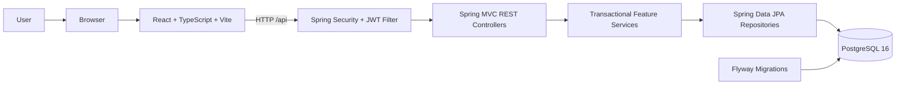
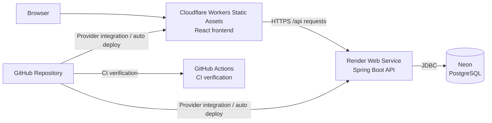
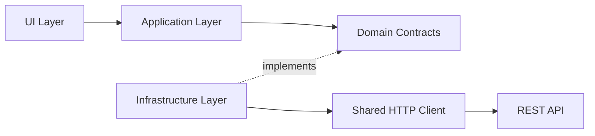
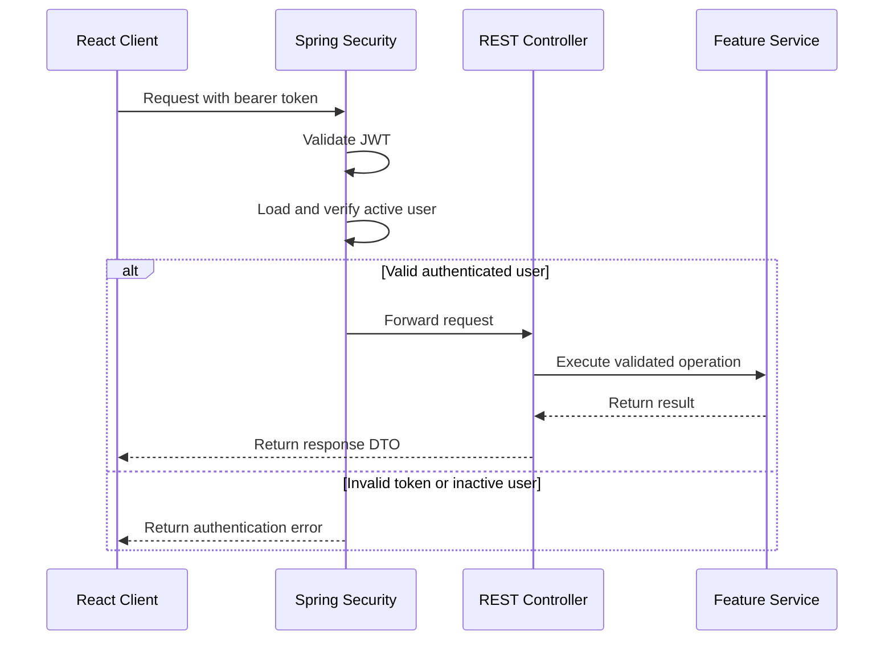
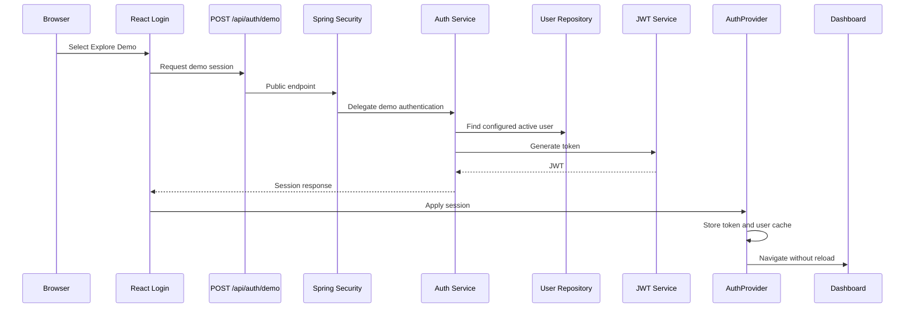
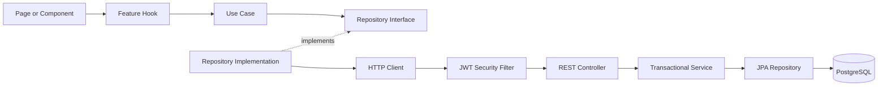
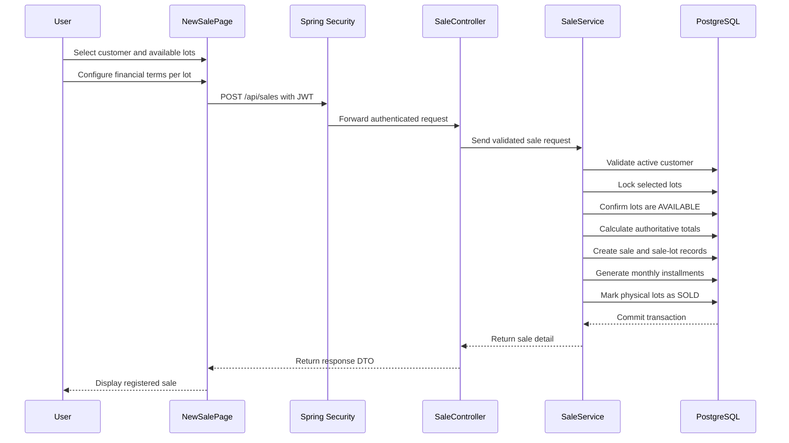
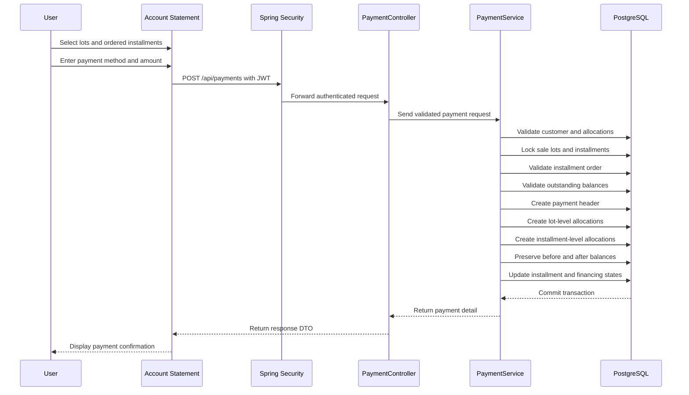

# Architecture

[Back to the main README](../README.md)

## System Overview

Land Sales System is a full-stack web application organized around business features.

The frontend and backend use different architectural approaches according to their responsibilities:

- **Frontend:** feature-based Clean Architecture.
- **Backend:** feature-oriented layered architecture.

The React client communicates with a Spring Boot REST API. Requests pass through Spring Security before reaching the REST controllers.

The backend validates request contracts, executes business rules inside transactional services, and persists data through Spring Data JPA repositories and a Flyway-managed PostgreSQL database.



### Public Deployment Architecture

The public portfolio demo uses external hosting providers:



GitHub Actions verifies backend, frontend, Docker, and E2E behavior. It does
not deploy to Cloudflare, Render, or Neon. Cloudflare and Render deployments are
managed by their own GitHub integrations and may run independently from CI.

## Architectural Principles

The application follows these principles:

- Separation of responsibilities.
- Organization by business feature.
- Dependency inversion in the frontend.
- Backend-controlled business rules and financial calculations.
- DTO-based REST contracts.
- Transactional consistency.
- Explicit database constraints.
- Centralized authentication and exception handling.
- Versioned database migrations.
- Isolation of UI, transport, business, and persistence concerns.

## Frontend Architecture

The frontend uses:

- React.
- TypeScript.
- Vite.
- Material UI.
- React Router.
- TanStack Query.
- React Hook Form.
- Zod.
- AG Grid.

Features are organized around business capabilities such as:

- Authentication.
- Dashboard.
- Blocks.
- Lots.
- Customers.
- Sales.
- Account statements.
- Payments.
- Reports.
- Reference plan.

Features that require business and API interaction separate presentation, application, domain, and infrastructure responsibilities.

```text
Page / Component
        ↓
Hook
        ↓
Use Case
        ↓
Repository Interface
        ↓
Repository Implementation
        ↓
HTTP Client
        ↓
REST API
```

### Frontend Layers

| Layer | Responsibility |
| --- | --- |
| Pages and components | Render screens, display information, and capture user interaction. |
| Hooks | Coordinate UI state, TanStack Query operations, mutations, notifications, and navigation. |
| Use cases | Represent application actions and coordinate feature workflows. |
| Domain models | Represent the business information required by the frontend. |
| Repository interfaces | Define the operations required by use cases without depending on HTTP details. |
| Repository implementations | Fulfill repository contracts through the backend REST API. |
| HTTP client | Handles the API base URL, JWT headers, JSON requests, responses, and shared authentication errors. |

### Dependency Inversion

Application use cases depend on repository interfaces rather than concrete HTTP implementations.

Infrastructure provides the concrete repository implementations that communicate with the backend.



This keeps pages and use cases independent from:

- Specific REST endpoints.
- Request libraries.
- Authentication transport details.
- Response-mapping behavior.

### Application Shell

`DashboardLayout` provides the protected application shell and coordinates:

- Sidebar navigation.
- Responsive navigation.
- Authenticated user information.
- Logout.
- Protected application content.

Frontend route protection improves navigation and user experience.

The backend remains the source of truth for authentication and authorization.

### UI-Only Features

Not every frontend feature requires all Clean Architecture layers.

The reference-plan feature is intentionally implemented as a smaller UI-focused feature because it displays static visual content and does not require API communication or business operations.

This avoids unnecessary abstractions in simple features.

The public demo uses a versioned fictitious reference-plan image at:

```text
/images/reference-plan/plan-reference-demo.png
```

The real reference plan is private and is not stored in the repository.
`VITE_REFERENCE_PLAN_IMAGE_URL` can override the image path for local or
provider-specific deployments.

## Backend Architecture

The backend runs on Java 17 and Spring Boot 4.1.0.

Business features are organized into packages such as:

- `auth`
- `user`
- `block`
- `lot`
- `lotification`
- `customer`
- `sale`
- `accountstatement`
- `payment`
- `report`

Shared packages provide security, exception handling, and common infrastructure.

```text
Controller
    ↓
Service
    ↓
Repository
    ↓
PostgreSQL
```

### Backend Layers

| Layer | Responsibility |
| --- | --- |
| Controller | Exposes REST endpoints, receives request DTOs and parameters, triggers validation, and returns response DTOs. |
| Service | Implements business rules, financial calculations, transaction boundaries, and workflow coordination. |
| Repository | Encapsulates persistence, queries, projections, pagination, and database locks. |
| Entity | Represents persisted relationships, values, and states. |
| DTO | Defines REST input and output contracts without exposing JPA entities. |
| Mapper | Converts between entities and DTOs through MapStruct where required. |
| Exception handling | Translates validation, authentication, resource, and conflict errors into consistent HTTP responses. |

### Business Logic Placement

Controllers do not contain financial calculations or persistence workflows.

The service layer is the source of truth for operations such as:

- Registering sales containing multiple lots.
- Confirming customer and lot eligibility.
- Calculating agreed, financed, and outstanding amounts.
- Generating monthly installments.
- Distributing decimal rounding differences.
- Applying payments in installment order.
- Supporting partial installment payments.
- Updating installment, sale-lot, and sale states.
- Preserving historical balances.
- Coordinating transactional writes.
- Preventing conflicting concurrent operations.

Repositories remain focused on persistence and query operations.

## Security Architecture

Spring Security protects the backend API through JWT authentication.

The public authentication endpoints are:

- `POST /api/auth/login`
- `POST /api/auth/demo`

Other business API requests require a valid bearer token.



The JWT filter validates the token and confirms that its associated user remains active before the request reaches a protected controller.

Frontend route guards are not treated as a security boundary.

### Reactive Authentication State

The frontend stores the JWT in browser storage, but route decisions do not rely
only on a one-time storage read.

`AuthProvider` keeps reactive authentication state:

- `hasSession` indicates that a stored session exists.
- `isAuthenticated` requires both a session and a validated current user.
- TanStack Query stores the current authenticated user.

Normal login and demo login use the same session-application flow:

1. Store the token.
2. Update React authentication state.
3. Store the authenticated user in TanStack Query cache.
4. Navigate to the dashboard.

This avoids requiring a manual page reload after login. A `401` from protected
requests clears the session centrally. Public authentication requests such as
login and demo access use `skipAuth`, so their own `401` responses do not
trigger a global logout loop.

Authentication requests use a bounded timeout. During Render cold starts, the
login UI shows loading feedback and an informational server-starting message
instead of leaving the user on an indefinite loading screen.



## Request and Response Flow

A standard authenticated operation follows this path:



Responses return through the same layers in reverse:

```text
PostgreSQL
    ↓
JPA Repository
    ↓
Service
    ↓
Controller
    ↓
HTTP Client
    ↓
Repository Implementation
    ↓
Hook
    ↓
Page / Component
```

## Sale Registration Flow

Sale registration is a transactional operation that may contain one or multiple lots.

Each selected lot preserves its own:

- Agreed price.
- Down payment.
- Financed amount.
- Installment count.
- Installment plan.



If any selected lot is unavailable or a validation fails, the complete operation is rolled back.

Sale numbers are stored as consecutive positive integers without prefixes or leading zeros.

## Payment Application Flow

A payment may be distributed across installments belonging to one or multiple financed lots owned by the same customer.

The backend validates:

- Customer ownership.
- Financed lot balances.
- Installment balances.
- Installment payment order.
- Partial payment rules.
- Payment totals.



Payment registration is completed as one transaction.

A validation or concurrency failure prevents partial payment information from being persisted.

Payment numbers are stored as consecutive positive integers without prefixes or leading zeros.

## Transaction and Concurrency Strategy

Financial write operations use Spring transaction boundaries.

### Sale Registration

Selected physical lots are locked before a sale is created.

This prevents two concurrent transactions from successfully selling the same available lot.

A partial unique database index provides an additional integrity layer against duplicate non-cancelled sales.

### Payment Registration

Related sale-lot financing records and installments are locked before balances and states are updated.

This prevents concurrent payments from:

- Exceeding an outstanding balance.
- Applying duplicate amounts.
- Updating installments from stale values.
- Producing inconsistent financing states.

### Optimistic and Pessimistic Concurrency

The `lots` version field supports optimistic concurrency detection for general record updates.

Pessimistic locks protect critical sale and payment workflows where current availability and balances must remain stable throughout the transaction.

Database constraints provide an additional consistency layer beyond service validation.

## Persistence and Schema Management

The persistence layer uses:

- Spring Data JPA.
- Hibernate.
- PostgreSQL 16.
- Flyway.
- Decimal database types for monetary values.
- Foreign keys.
- Unique constraints.
- Check constraints.
- Indexes.
- Transactional locks.

Flyway migrations are the source of truth for the database schema.

```text
Flyway migrations
        ↓
PostgreSQL schema
        ↓
Hibernate validation
```

Hibernate uses:

```text
ddl-auto=validate
```

The application validates the schema without attempting to generate or modify it automatically.

See [Database Design](database.md) for the tables, relationships, indexes, and financial constraints.

## API Contracts and Validation

Controllers expose DTO-based REST contracts.

Request validation is performed through Bean Validation before operations reach the service layer.

Services perform additional business validation that cannot be expressed through field-level constraints alone.

The backend does not expose JPA entities directly.

This protects:

- Persistence implementation details.
- Internal entity relationships.
- Fields that must not be accepted from the client.
- Financial values calculated by the backend.

Springdoc OpenAPI generates the API contract and Swagger UI from controllers and DTO definitions.

See [REST API Overview](api-overview.md) for the documented endpoints.

## Error Handling

Feature-specific exceptions are translated by a global exception handler into consistent HTTP responses.

```text
Controller or Service
        ↓
Feature Exception
        ↓
Global Exception Handler
        ↓
Structured HTTP Error Response
```

This keeps HTTP error-response construction outside controllers and business services.

The shared handler provides consistent responses for errors such as:

- Invalid requests.
- Authentication failures.
- Missing resources.
- Business conflicts.
- Financial validation failures.

## Repository Organization

The repository is organized around application responsibilities and business features.

```text
land-sales-backend/
└── src/main/java/.../
    ├── auth/
    ├── security/
    ├── user/
    ├── block/
    ├── lot/
    ├── lotification/
    ├── customer/
    ├── sale/
    ├── accountstatement/
    ├── payment/
    ├── report/
    └── shared/

land-sales-frontend/
└── src/
    ├── app/
    ├── shared/
    └── features/
```

Backend features contain the technical layers required by their workflows.

Frontend features contain the presentation, application, domain, and infrastructure elements required by their complexity.

## Architectural Benefits

The selected architecture provides project-specific benefits:

- UI components remain independent from direct HTTP implementation details.
- Business workflows are grouped by feature instead of only by technical type.
- Financial calculations remain centralized in backend services.
- Sales and payments cannot be partially persisted.
- DTOs protect persistence entities from direct API exposure.
- Concurrency controls protect lot availability and financial balances.
- Historical payment information remains reproducible.
- Database evolution is controlled through versioned migrations.
- Simple UI-only features can remain lightweight without unnecessary layers.
- Changes can be localized to the business feature they affect.

## Related Documentation

- [Main README](../README.md)
- [Business Rules](business-rules.md)
- [Database Design](database.md)
- [REST API Overview](api-overview.md)
- [Development Guide](development-guide.md)
- [Deployment Guide](deployment.md)
- [User Manual](user-manual.md)
