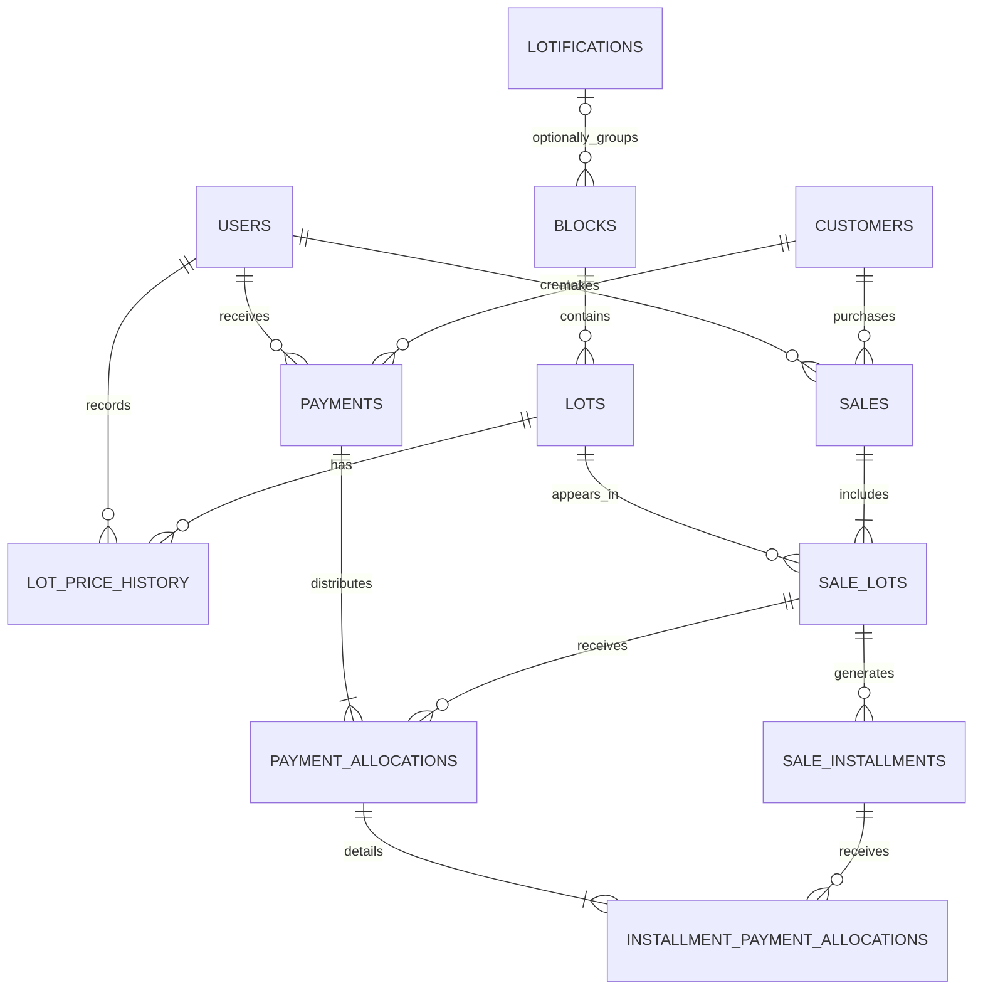

# Database Design

[Back to the main README](../README.md)

## Overview

Land Sales System uses PostgreSQL 16 as its relational database.

The schema is managed through versioned Flyway migrations located in:

```text
land-sales-backend/src/main/resources/db/migration/
```

Flyway migrations are the source of truth for the database schema. Hibernate uses:

```text
ddl-auto=validate
```

This configuration allows the application to verify that the JPA entity model matches the database without automatically creating or modifying tables.

The database design focuses on:

- Relational integrity.
- Accurate monetary calculations.
- Independent financing terms for each lot.
- Historical payment traceability.
- Transactional consistency.
- Protection against duplicate lot sales.
- Controlled schema evolution.
- Preservation of historical business records.

## Main Tables

| Table | Purpose | Key data |
| --- | --- | --- |
| `users` | Stores authenticated application users. | Username, credentials, active status, and user identity. |
| `blocks` | Represents physical blocks containing lots. | Normalized code, planned lot capacity, total area, and notes. |
| `lots` | Stores individual physical lots. | Block, lot number, generated code, dimensions, current price, status, and version. |
| `lot_price_history` | Preserves lot price changes. | Previous price, new price, reason, date, lot, and user. |
| `customers` | Stores customer information. | Full name, phone numbers, address, and active status. |
| `sales` | Stores sale headers and consolidated totals. | Sale number, customer, date, totals, status, and creator. |
| `sale_lots` | Stores the commercial and financing terms of every lot included in a sale. | Agreed price, down payment, financed amount, balance, installment count, and financing status. |
| `sale_installments` | Stores the installment plan for each financed lot. | Installment number, payment month, amount, paid amount, balance, and state. |
| `payments` | Stores payment headers. | Payment number, customer, date, method, total amount, reference, and receiving user. |
| `payment_allocations` | Stores how a payment was distributed among financed lots. | Applied amount and lot balance before and after payment. |
| `installment_payment_allocations` | Stores the detailed distribution of a payment among installments. | Applied amount and installment balance before and after payment. |

## Legacy and Compatibility Tables

The schema also contains tables retained for compatibility or reference purposes:

| Table | Purpose |
| --- | --- |
| `lotifications` | Stores legacy or reference grouping information. |
| `lot_map_shapes` | Stores optional legacy map geometry associated with lots. |

The relationship between `blocks` and `lotifications` is nullable after migration V8, so a block can be stored without an associated lotification. The current dashboard and lot query flow can operate without an active lotification; the optional relationship remains for compatibility.

The reference-plan screen uses static visual content and does not depend on these tables for its main user-facing behavior.

## Domain Model

A physical lot is stored independently from the financial conditions under which it is sold.

```text
Block
    └── Lot
          └── Sale Lot
                └── Sale Installment
                      └── Installment Payment Allocation
```

The commercial and payment relationships follow this structure:

```text
Customer
    ├── Sale
    │     └── Sale Lot
    │           └── Sale Installment
    │
    └── Payment
          └── Payment Allocation
                └── Installment Payment Allocation
```

This separation allows:

- A physical lot to retain its current listed price.
- A sale to preserve the agreed price at the time of purchase.
- Multiple lots in the same sale to have different financing terms.
- Historical sales to remain unchanged when current lot prices change.
- Payments to be traced from the payment header to each affected installment.

## Entity-Relationship Diagram



## Land and Customer Data

### Blocks

A block groups physical lots and stores planning information such as:

- Normalized block code.
- Planned lot capacity.
- Total block area.
- Notes.

Block codes are normalized to uppercase.

A block containing registered lots cannot be deleted because its relationships with physical and historical records must be preserved.

### Lots

A lot belongs to one block and stores:

- Lot number.
- Generated code.
- Area.
- Frontage.
- Depth.
- Current price.
- Physical status.
- Version used for optimistic concurrency control.

Supported physical states are:

- `AVAILABLE`
- `BLOCKED`
- `SOLD`

Manual status changes are limited to:

```text
AVAILABLE ↔ BLOCKED
```

A lot becomes `SOLD` through the sale-registration workflow and remains physically marked as `SOLD` after its financing has been fully paid.

### Lot Price History

Price changes are stored separately from the current lot record.

Each history record preserves:

- Previous price.
- New price.
- Change reason.
- User who performed the change.
- Date of the change.

Historical sales are not recalculated when a lot's current price changes.

### Customers

Customers are preserved as historical business records.

Customer data includes:

- Full name.
- Primary phone.
- Alternate phone.
- Address.
- Active status.

The primary phone is required but is not unique. Different customers may share the same phone number.

Deactivation does not delete a customer. Inactive customers may continue to appear in account statements and historical sales when financial obligations exist.

## Sales and Financing Model

### Sales

The `sales` table stores the sale header:

- Consecutive numeric sale number.
- Customer.
- Sale date.
- Total agreed price.
- Total down payment.
- Total financed amount.
- Sale status.
- User who registered the sale.

Sale numbers are positive consecutive integers without prefixes or leading zeros.

A sale may contain one or multiple lots. The header totals summarize the independent values stored in `sale_lots`.

Supported sale states are:

- `ACTIVE`
- `PAID`
- `CANCELLED`

The presence of a state in the persistence model does not necessarily mean that every transition is exposed through the current user interface.

### Sale Lots

The `sale_lots` table is the core of the financing model.

It connects a physical lot with a sale while preserving the commercial terms agreed for that specific transaction.

Each record stores:

- Physical lot.
- Agreed price.
- Down payment.
- Financed amount.
- Current outstanding balance.
- Installment count.
- Installment amount.
- Financing status.

This design allows one sale to contain multiple lots with different:

- Agreed prices.
- Down payments.
- Financed balances.
- Installment counts.
- Monthly amounts.

The two records represent different concepts:

- `lots` represents the physical property.
- `sale_lots` represents the financial conditions under which that property was sold.

### Installments

A financed sale lot generates one or more records in `sale_installments`.

Each installment stores:

- Installment number.
- Payment month.
- Original amount.
- Paid amount.
- Remaining balance.
- State.

Supported states are:

- `PENDING`
- `PARTIAL`
- `PAID`

`payment_month` is normalized to the first day of its corresponding month.

For example:

```text
2026-08-01
```

The day does not represent a payment deadline. It is an internal representation of August 2026.

The schema does not model:

- Overdue installments.
- Late-payment states.
- Interest.
- Penalties.
- Late fees.

Installment amounts use decimal arithmetic. When equal division produces a rounding difference, the final installment absorbs the difference so that the installment total exactly matches the financed amount.

## Payment and Allocation Model

### Payments

The `payments` table stores the general information about money received from a customer:

- Consecutive numeric payment number.
- Customer.
- Payment date.
- Payment method.
- Total amount.
- Reference when applicable.
- User who received the payment.

Payment numbers are generated through:

```text
payment_number_seq
```

They are positive consecutive integers without prefixes or leading zeros.

Supported payment methods are:

- `CASH`
- `TRANSFER`

### Lot-Level Allocations

A single payment may cover installments from one or multiple financed lots.

For each affected sale lot, `payment_allocations` preserves:

- Amount applied to the lot.
- Lot balance before payment.
- Lot balance after payment.
- Relationship with the payment.
- Relationship with the financed sale lot.

This makes it possible to reconstruct how the total payment was distributed among lots.

### Installment-Level Allocations

`installment_payment_allocations` stores the most detailed payment history.

For every affected installment, it preserves:

- Applied amount.
- Installment balance before payment.
- Installment balance after payment.
- Relationship with the lot-level allocation.
- Relationship with the installment.

Allocation records are historical facts. They are not recalculated from current balances when a payment detail or receipt is viewed again.

This allows the application to reproduce:

- Payment details.
- Printable receipts.
- Previous balances.
- Resulting balances.
- Installments covered by each payment.

## Financial Integrity

Monetary values use:

```sql
NUMERIC(14,2)
```

This avoids binary floating-point errors and provides consistent decimal precision for financial operations.

Important formulas include:

```text
sales.total_agreed_price
    = sales.total_down_payment
    + sales.total_financed_amount
```

```text
sale_lots.financed_amount
    = sale_lots.agreed_price
    - sale_lots.down_payment
```

```text
payment_allocations.balance_after
    = payment_allocations.balance_before
    - payment_allocations.amount
```

```text
installment_payment_allocations.installment_balance_after
    = installment_payment_allocations.installment_balance_before
    - installment_payment_allocations.amount
```

Check constraints protect values such as:

- Agreed prices.
- Down payments.
- Financed amounts.
- Outstanding balances.
- Payment amounts.
- Installment amounts.
- Paid amounts.
- Before-and-after balance relationships.

Negative financial values are rejected when they would violate the business model.

## Constraints and Indexes

The database provides a second integrity layer in addition to backend validation.

### Uniqueness

The schema enforces uniqueness for identifiers and sequences such as:

- Usernames.
- Block codes.
- Lot identification within its applicable scope.
- Sale numbers.
- Payment numbers.
- Installment numbers within a financed lot.
- Payment months within a financed lot.

### Duplicate Sale Protection

A partial unique index prevents the same physical lot from appearing in more than one non-cancelled sale.

This protects the database even when concurrent requests attempt to sell the same lot.

The service layer also locks and validates selected lots before creating a sale.

### Foreign Keys

Foreign keys preserve relationships between:

- Users and registered sales.
- Users and received payments.
- Customers and sales.
- Customers and payments.
- Blocks and lots.
- Lots and sale-lot records.
- Sales and sale-lot records.
- Sale lots and installments.
- Payments and allocations.
- Installments and allocation history.

Deletion is restricted where removing a referenced record would invalidate historical or financial information.

### Indexes

Indexes support frequent operations such as:

- Filtering active users and customers.
- Searching blocks and lots.
- Filtering lots by status.
- Finding sales and payments by customer or date.
- Filtering sales by status and payments by method.
- Loading installments and payment allocations.
- Building account statements.
- Supporting pagination and relationship lookups.

Indexes improve common query patterns without replacing appropriate query design.

## Database and Service Responsibilities

The database enforces structural and financial integrity, including:

- Required relationships.
- Unique identifiers.
- Non-negative values.
- Valid balance formulas.
- Protection against duplicate lot sales.
- Preservation of historical payment relationships.

The Spring Boot service layer coordinates workflow rules that require contextual or ordered validation, including:

- Confirming that customers are active before a sale.
- Confirming that selected lots are available.
- Recalculating financial totals.
- Generating installments.
- Applying payments in chronological order.
- Preventing gaps between selected installments.
- Allowing a partial payment only on the final selected installment.
- Preventing payments from exceeding outstanding balances.
- Updating installment, financing, and sale states.

The backend does not treat frontend-calculated totals as authoritative.

For the complete workflow rules, see [Business Rules](business-rules.md).

## Transactions and Concurrency

Sale and payment registration use Spring transaction boundaries.

### Sale Registration

During sale registration:

1. The selected lots are locked.
2. Their current status is validated.
3. The sale header is created.
4. Independent sale-lot terms are stored.
5. Monthly installments are generated.
6. Physical lots are changed to `SOLD`.
7. The complete operation is committed.

A validation or concurrency failure rolls back the entire transaction.

The version field in `lots` supports optimistic concurrency detection, while pessimistic locks protect the critical sale-registration workflow.

### Payment Registration

During payment registration:

1. Related sale-lot records and installments are locked.
2. Current balances are validated.
3. The payment header is created.
4. Lot-level allocations are stored.
5. Installment-level allocations are stored.
6. Before-and-after balances are preserved.
7. Installment and financing states are updated.
8. The complete operation is committed.

A validation or concurrency failure prevents partial payment information from being persisted.

## Schema Management

The schema has evolved through Flyway migrations to support:

- Land and customer management.
- Multi-lot sales.
- Independent financing conditions.
- Monthly installment plans.
- Fully paid sales.
- Payment headers and allocation history.
- Consecutive numeric sale and payment numbers.
- Optional lotification relationships.
- Financial constraints and concurrency protection.

New schema changes must be introduced through additional Flyway migrations.

Previously applied migrations must not be modified after they have been shared or executed in another environment.

When changing the schema:

- Create a new migration.
- Keep JPA entities aligned with the resulting database.
- Verify constraints and indexes.
- Test both new installations and upgrades when possible.
- Run backend tests and Hibernate schema validation.

## Related Documentation

- [Main README](../README.md)
- [Architecture](architecture.md)
- [Business Rules](business-rules.md)
- [REST API Overview](api-overview.md)
- [Development Guide](development-guide.md)
- [User Manual](user-manual.md)
