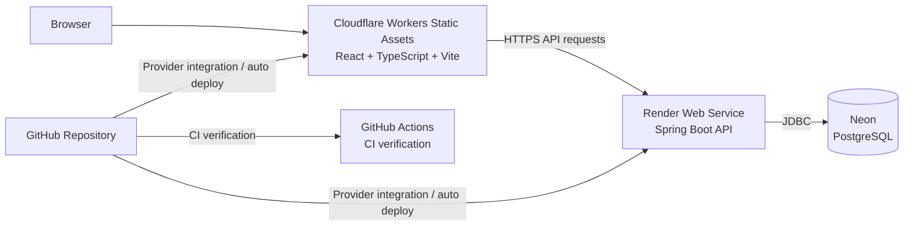

# Deployment Guide

[Back to the main README](../README.md)

## Purpose and Scope

This guide documents the public portfolio deployment for Land Sales System.
It covers Cloudflare Workers Static Assets, Render, Neon, demo access, health
checks, GitHub Actions verification, and post-deployment checks.

The public deployment is a demo for portfolio review. It is not a hardened
production environment for real business operations.

## Public Architecture



GitHub Actions verifies the repository. It does not deploy to Cloudflare,
Render, or Neon.

## Public URLs

| Service | URL |
| --- | --- |
| Frontend demo | `https://land-sales-system.angelica-guerrero.workers.dev/` |
| Backend API | `https://land-sales-api.onrender.com` |
| API base URL | `https://land-sales-api.onrender.com/api` |
| Render liveness check | `https://land-sales-api.onrender.com/actuator/health/liveness` |
| General application health | `https://land-sales-api.onrender.com/actuator/health` |

Render's Health Check Path is `/actuator/health/liveness`. The general
`/actuator/health` endpoint remains useful for diagnostics, but it is not the
primary Render health check path.

## Cloudflare Frontend Deployment

The frontend is located in:

```text
land-sales-frontend/
```

It is a React, TypeScript, and Vite application deployed with Cloudflare Workers
Static Assets.

| Setting | Value |
| --- | --- |
| Production branch | `main` |
| Root directory | `land-sales-frontend` |
| Build command | `npm ci && npm run build` |
| Build output directory | `dist` |
| API variable | `VITE_API_BASE_URL=https://land-sales-api.onrender.com/api` |
| Reference plan override | `VITE_REFERENCE_PLAN_IMAGE_URL` |

The repository does not include a `wrangler.toml` file. Other Cloudflare options
are managed in the Cloudflare dashboard.

Vite embeds `VITE_*` variables into the browser bundle. Never store secrets,
passwords, JWT secrets, or database credentials in `VITE_*` variables.

The deployed SPA must serve `index.html` for direct React Router routes such as
`/clientes`, `/lotes`, `/reportes`, and `/plano`.

## Render Backend Deployment

The backend is located in:

```text
land-sales-backend/
```

The public backend runs as a Render Web Service using Docker and the backend
Dockerfile:

```text
land-sales-backend/Dockerfile
```

| Setting | Current demo configuration |
| --- | --- |
| Service type | Web Service |
| Runtime | Docker |
| Production branch | `main` |
| Root directory | `land-sales-backend` |
| Dockerfile | `Dockerfile` |
| Health Check Path | `/actuator/health/liveness` |
| Start command | Dockerfile `ENTRYPOINT` |
| Auto deploy | External Render GitHub integration |

Render provides the runtime `PORT` variable. Spring Boot reads it through:

```yaml
server:
  port: ${PORT:8080}
```

No additional address-binding variable or fixed Render port is required by the
current repository configuration.

The public Render service uses:

```text
SPRING_PROFILES_ACTIVE=demo
```

The application defines a `demo` profile group that includes `docker`
configuration:

```yaml
spring:
  profiles:
    group:
      demo:
        - docker
```

Because `demo` includes `docker`, the datasource configuration is resolved from
Render environment variables such as `SPRING_DATASOURCE_URL`,
`SPRING_DATASOURCE_USERNAME`, and `SPRING_DATASOURCE_PASSWORD`.

## Neon Database

Neon provides managed PostgreSQL for the public demo.

Render passes database connection settings to Spring Boot through environment
variables:

- `SPRING_DATASOURCE_URL`
- `SPRING_DATASOURCE_USERNAME`
- `SPRING_DATASOURCE_PASSWORD`

The datasource URL must be a valid JDBC PostgreSQL URL. TLS/SSL behavior depends
on the parameters included in that URL. Do not commit real Neon hostnames,
passwords, users, connection strings, or project IDs.

At backend startup:

1. Flyway applies pending migrations from `land-sales-backend/src/main/resources/db/migration/`.
2. Hibernate validates the schema with `ddl-auto=validate`.
3. The API starts only if the schema matches the JPA model.

GitHub Actions does not create, migrate, or deploy Neon. Schema changes must be
versioned through Flyway migrations, not manual database edits. The public demo
database must contain only fictional data.

## Environment Variables

### Cloudflare

| Variable | Required | Secret | Purpose |
| --- | --- | --- | --- |
| `VITE_API_BASE_URL` | Yes | No | Browser API base URL. |
| `VITE_REFERENCE_PLAN_IMAGE_URL` | Optional | No | Overrides the reference plan path. |

`VITE_REFERENCE_PLAN_IMAGE_URL` defaults to:

```text
/images/reference-plan/plan-reference-demo.png
```

### Render

| Variable | Secret | Purpose |
| --- | --- | --- |
| `SPRING_PROFILES_ACTIVE` | No | Active Spring profile, for example `demo` when configured for the public demo. |
| `SPRING_DATASOURCE_URL` | Yes | JDBC URL for Neon PostgreSQL. |
| `SPRING_DATASOURCE_USERNAME` | Yes | Database username. |
| `SPRING_DATASOURCE_PASSWORD` | Yes | Database password. |
| `JWT_SECRET` | Yes | JWT signing secret. |
| `JWT_EXPIRATION` | No | JWT lifetime, for example `PT2H`. |
| `APP_CORS_ALLOWED_ORIGINS` | No | Comma-separated allowed frontend origins. |
| `BOOTSTRAP_ADMIN_USERNAME` | No | Initial administrator username. |
| `BOOTSTRAP_ADMIN_PASSWORD` | Yes | Initial administrator password. |
| `BOOTSTRAP_ADMIN_FULL_NAME` | No | Initial administrator display name. |
| `APP_DEMO_ENABLED` | No | Enables the demo endpoint. Defaults to `false`. |
| `APP_DEMO_USERNAME` | No | Existing active user used by demo access. |

`APP_CORS_ALLOWED_ORIGINS` must include:

```text
https://land-sales-system.angelica-guerrero.workers.dev/
```

Do not use `*` for authenticated browser requests.

## Demo Access

The demo button calls:

```http
POST /api/auth/demo
```

Flow:

1. The user selects **Explore Demo** or **Explorar la demo**.
2. The frontend calls `POST /api/auth/demo`.
3. The endpoint works only when `APP_DEMO_ENABLED=true`.
4. The backend reads `APP_DEMO_USERNAME`.
5. The backend finds an existing active user.
6. The backend creates a JWT with the same service used by normal login.
7. The backend returns the same session contract as `POST /api/auth/login`.
8. The frontend stores the token.
9. `AuthProvider` updates React session state.
10. TanStack Query receives the authenticated user in cache.
11. React Router navigates to the dashboard without a page reload.

The frontend never receives, stores, or embeds a demo password. When demo access
is disabled, the backend does not reveal internal details.

## Authentication State and Cold Starts

Render free-tier services may sleep after inactivity. The frontend handles this
case in the login screen:

- Normal login shows `Iniciando sesión...`.
- Demo login shows `Preparando la demo...`.
- After several seconds, the UI explains that the demo server is starting.
- Authentication requests have a bounded timeout.
- A successful response updates token storage, React auth state, TanStack Query,
  and navigation without requiring a manual refresh.

If the timeout is reached, the UI shows a friendly error and re-enables the
buttons. It does not save a partial session.

## Health Checks

Spring Boot Actuator probes are enabled. Spring Security permits:

```text
GET /actuator/health/**
```

### Render liveness check

```http
GET /actuator/health/liveness
```

- Public.
- Does not require JWT.
- Used by Render's Health Check Path.
- Verifies that the Spring Boot process is alive.
- Should not depend unnecessarily on Neon availability.

### General health

```http
GET /actuator/health
```

- Public.
- General diagnostic endpoint for the application.
- May include additional health contributors according to Actuator configuration.
- Sensitive health details are not exposed.

### Readiness

```http
GET /actuator/health/readiness
```

- Public.
- Indicates whether the application is ready to receive traffic.

The backend Dockerfile and E2E Docker Compose configuration currently use
`/actuator/health`. That is intentional and should not be documented as Render's
Health Check Path.

## GitHub Actions

The workflow is:

```text
.github/workflows/ci.yml
```

Triggers:

- Pull requests targeting `main`.
- Pushes to `main`.
- Manual `workflow_dispatch`.

Jobs:

| Job | What it does |
| --- | --- |
| Backend verification | Ubuntu runner, Java 17 Temurin, Maven cache, `./mvnw -B clean verify`. |
| Frontend verification | Node.js 22, npm cache, `npm ci`, `npm run lint`, `npm run test`, `npm run build`. |
| Backend Docker build | Docker Buildx builds `land-sales-backend/Dockerfile` with `push: false`. |
| E2E verification | Installs Chromium, validates `docker-compose.e2e.yml`, starts disposable PostgreSQL/backend/frontend, runs Playwright, uploads artifacts on failure, and stops the environment. |

GitHub Actions verifies the project. It does not deploy to Cloudflare, Render,
or Neon.

## Deployment Flow

A push or merge to `main` can start multiple independent processes:

1. GitHub Actions starts CI verification.
2. Cloudflare's GitHub integration may detect the same change and build the frontend.
3. Render's GitHub integration may detect the same change and build the backend.

GitHub Actions does not orchestrate those deployments. CI and provider
deployments may run in parallel. Whether a provider waits for checks depends on
external provider configuration, not on this repository.

## Post-Deployment Verification

1. Confirm GitHub Actions completed successfully.
2. Confirm the Cloudflare deployment completed.
3. Confirm the Render deployment completed.
4. Open `https://land-sales-api.onrender.com/actuator/health/liveness`.
5. Confirm the response contains `"status":"UP"`.
6. Open `https://land-sales-system.angelica-guerrero.workers.dev/`.
7. Test normal login.
8. Test **Explore Demo** / **Explorar la demo**.
9. Confirm the dashboard opens without manually reloading.
10. Reload a protected route and confirm the session is restored.
11. Log out.
12. Open the reference plan.
13. Confirm the fictitious image loads from `/images/reference-plan/plan-reference-demo.png`.
14. Inspect an API request in browser DevTools.
15. Confirm there are no CORS errors.
16. After inactivity, test the Render cold start flow.

## Troubleshooting

| Symptom | Check |
| --- | --- |
| Render reports `Port scan timeout reached` | Confirm Docker starts the Spring Boot jar through `ENTRYPOINT` and Spring reads `PORT`. |
| Render health check times out | Confirm Health Check Path is `/actuator/health/liveness`. |
| Health check returns `401` | Confirm Spring Security permits `GET /actuator/health/**`. |
| Neon connection fails | Verify Render datasource variables and the JDBC URL. Do not expose the real URL in logs or docs. |
| Flyway migration fails | Fix the migration path through a new Flyway migration when the change has been shared. Do not manually edit the demo schema. |
| Browser shows CORS errors | Confirm `APP_CORS_ALLOWED_ORIGINS` includes the Cloudflare frontend origin. |
| Frontend calls localhost in production | Confirm `VITE_API_BASE_URL=https://land-sales-api.onrender.com/api` was set during the Cloudflare build. |
| Reference plan shows fallback | Confirm the asset exists at `/images/reference-plan/plan-reference-demo.png` and that `VITE_REFERENCE_PLAN_IMAGE_URL` is not pointing to a missing private file. |
| Login stores a token but does not navigate | Confirm the deployed frontend includes the reactive auth-state fix in `AuthProvider`. |
| First demo login is slow | Render may be waking from cold start; wait for the loading flow or retry after the timeout. |
| Cloudflare shows an older frontend | Confirm the latest Cloudflare deployment, build variables, and cache/deployment state in the Cloudflare dashboard. |

## Security and Privacy

- Do not commit `.env`, JWT secrets, database credentials, or real passwords.
- Do not put secrets in `VITE_*` variables.
- Use only fictional customers, sales, payments, and plan data in the public demo.
- The real reference plan is private and must not be committed.
- The demo account should be dedicated to the demo environment.

## Demo vs Production

The public deployment demonstrates the architecture and user workflows. A real
production installation would still need:

- Operational monitoring and alerting.
- Backup and restore procedures.
- Secret rotation.
- Access policy review.
- Production data governance.
- Incident response and rollback procedures.
- Load, capacity, and availability planning.

Do not use the public demo for real business operations.
